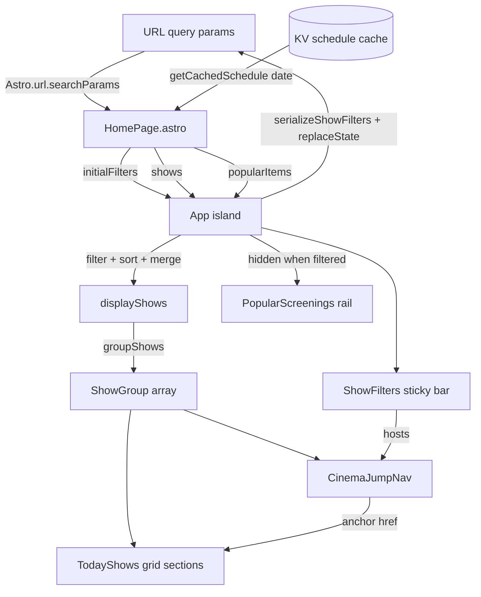

# UX Audit

### Verdict on the carousel — remove it (mostly)

**Yes, remove the carousels from the schedule.** But keep the single "Popular now" rail.

The critical detail is *how many* carousels there are. `TodayShows.tsx` does not render one carousel — it renders **one Embla carousel per group**:

```tsx
// TodayShows.tsx:160
{[...groups.entries()].map(([key, group]) => (
  <ShowCarousel key={`${view}-${key}`} ... />
))}
```

- In the default **`view="cinema"`** mode, groups = cinemas → up to **23 stacked carousels** (`src/data/cinemas.ts` has 23 venues).
- In **`view="film"`** mode, groups = film titles → potentially **100+ carousels**, most of them containing 1–2 cards.

Each carousel shows ~4–5 cards at `basis-56 sm:basis-64`, so on a typical evening the majority of the day's films are hidden behind horizontal scroll, in 23 separate scroll contexts. That is the single biggest reason the page is hard to navigate.

**Why the popular rail is different and should stay:** `PopularScreenings.tsx` is a short, curated, editorial set (a handful of items), and it is a plain CSS `snap-x` scroller — not even the Embla component. A horizontal rail is an appropriate pattern for "here are a few highlights"; it is the wrong pattern for "here is the entire day's repertoire".

The project already has the right precedent: `FilmDetails.tsx:274` renders its cinema groups as `<section className="grid gap-4 md:grid-cols-2">`, and `UpcomingReleases.tsx:97` uses `grid gap-3 lg:grid-cols-2`. The homepage is the odd one out.

---

### Full findings list

#### A. Results layout — the carousels

 # | Finding | Fix |
---|---|---|
 A1 | **23 carousels stacked vertically.** Most films are invisible without 23 separate horizontal swipes. No way to scan or compare. | Responsive card grid per section. ✅ *in this plan* |
 A2 | **Browser find-in-page is broken.** Embla keeps off-screen slides in the DOM but transformed out of view, so `Ctrl+F` scrolls to invisible content. | Grid puts everything in normal flow. ✅ |
 A3 | **`mx-8 sm:mx-10` on the `<Carousel>`** reserves gutters for the arrows, shrinking usable width by ~80px on every section. | Full-width grid. ✅ |
 A4 | **`view="film"` degenerates badly** — dozens of carousels holding a single card each, with arrows that do nothing. | Grid collapses to a single row naturally. ✅ |
 A5 | **No per-section overflow control.** A cinema with 20 films renders 20 slides regardless. | Cap each section at N cards with a "show all (N)" expander. ✅ |

#### B. Filters and controls

 # | Finding | Fix |
---|---|---|
 B1 | **Filters scroll away.** The filter card is at the top; by section 12 the user must scroll all the way back to change anything. | Sticky filter bar under the header. ✅ |
 B2 | **No active-filter feedback while scrolling.** Nothing tells you *why* you are seeing 4 films instead of 60. | Active-filter chips with individual dismiss. ✅ |
 B3 | **Filter state is not in the URL.** Results cannot be shared, bookmarked, or restored with the back button; the locale switch drops all filters. | SSR-seeded query params + `replaceState`. ✅ |
 B4 | **"Group by" and "Sort by" are buried** at the bottom of the filter card, below search and time inputs — yet grouping has the biggest effect on the layout. | Promote to the always-visible sticky row. ✅ |
 B5 | **Search only matches the title** (`App.tsx:93` matches `canonicalTitle` + `title`). Typing "Muranów" returns nothing. | Extend the match to the cinema name. ✅ |
 B6 | **Empty state has no escape hatch.** `TodayShows` shows "no matches" text but no button to clear the filters that caused it. | Reset CTA inside the `Empty` block. ✅ |
 B7 | **No debounce on search** — every keystroke re-filters, re-sorts, re-merges and re-renders every card. | Debounce the query, mirroring `UpcomingReleases.tsx:181`. ✅ |
 B8 | **`type="time"` inputs for "From"/"Until"** are clumsy on mobile and duplicate what the presets already do. | *Deferred* — consider a range slider or hour chips later. |

#### C. Orientation and navigation

 # | Finding | Fix |
---|---|---|
 C1 | **No way to jump to a cinema.** The only venue links are in the footer, and they navigate away to `/kino/<slug>/`. | Sticky in-page jump nav with per-cinema film counts. ✅ |
 C2 | **Section headings carry no count context** beyond a bare badge, so you cannot tell which venue is worth opening. | Counts in the jump nav and in section headers. ✅ |
 C3 | **No "back to top"** on a page that can run tens of thousands of pixels tall. | Covered by the sticky bar staying reachable. ✅ |
 C4 | **Section order is alphabetical-ish by cinema name**, so a venue with 1 film outranks one with 15. | *Deferred* — could sort sections by film count. |

#### D. Date selection

 # | Finding | Fix |
---|---|---|
 D1 | **`DateSelector` forces horizontal scroll on mobile** — `grid min-w-2xl grid-cols-7` (`DateSelector.tsx:23`) is 42rem wide inside a `-mx-4 overflow-x-auto` wrapper, with no affordance that days 5–7 exist off-screen. | Let the grid shrink, or use compact scroll-snap chips. ✅ |
 D2 | **The selected date is not visible once scrolled past**, and the date is not in the URL either. | Selected date shown in the sticky bar + `?date=`. ✅ |

#### E. Above the fold

 # | Finding | Fix |
---|---|---|
 E1 | **The popular rail renders *before* the hero** (`HomePage.astro:228`), so the page opens with a poster rail, then a headline, then the date picker, then filters — controls land far below the fold. | Slim hero → date → filters → popular rail → results. ✅ |
 E2 | **The hero is very tall** — `text-5xl` headline, eyebrow, description paragraph, and a `pb-8` border, all above the first control. | Compress to one line with the counts inline. ✅ |

#### F. Performance and accessibility

 # | Finding | Fix |
---|---|---|
 F1 | **23 Embla instances** each install resize/pointer observers and run layout math on mount and on every window resize. | Removing them eliminates the cost entirely. ✅ |
 F2 | **Carousel arrows are keyboard-focusable but positioned in the gutters**, adding 46 extra tab stops before the user reaches any film. | Grid has no arrows. ✅ |
 F3 | **Every poster loads at `500x750`** with `loading="lazy"` but no `srcset`/`sizes`, while displayed at ~224px. | *Deferred* — needs an image proxy decision. |
 F4 | **The entire page is one `client:load` island.** Hero, date picker, filters and all results hydrate together on first paint. | *Deferred* — the grid removal already cuts most of the JS work. |

---

### What this plan implements

Everything marked ✅ above, organised around your choices: grid + retained popular rail, sticky filter bar, URL-synced filters, cinema jump nav, and a slim hero with the controls first.

# Requirements

### Overview & Goals

Make the KinoRadar landing page scannable. Today a visitor must swipe through up to 23 independent horizontal carousels to see what is playing in Warsaw. After this change the day's repertoire is laid out in readable grids, the filters stay within reach while scrolling, results are addressable by URL, and a jump nav lets users go straight to a venue.

### Scope

**In scope**

- Replace the per-group Embla carousels in `TodayShows.tsx` with a responsive card grid plus a per-section "show all" expander.
- Add a sticky filter bar with active-filter chips, promoted group/sort controls, and a debounced search that also matches cinema names.
- Add a sticky cinema jump nav with per-group film counts and smooth anchor scrolling.
- Sync filter state (`date`, `q`, `cinema`, `from`, `to`, `soon`, `en`, `view`, `sort`) to the URL, seeded server-side from `Astro.url.searchParams`.
- Slim the hero and reorder the landing page to: hero → date → filters → popular rail → results.
- Keep `PopularScreenings` as a horizontal rail, moved inside `App` so it sits between the filters and the results and hides when filters are active.
- Improve the empty state with a "clear filters" action.
- Reduce the `DateSelector` mobile overflow.

**Out of scope**

- Any change to scrapers, parsers, KV caching, or the `/api/*` endpoints.
- The releases page (`UpcomingReleases`), favorites page, film detail page, and cinema pages — except where they consume shared components.
- Responsive image sources / an image proxy (audit F3).
- Splitting `App` into finer-grained islands (audit F4).
- New visual design tokens; the existing shadcn + Tailwind v4 look stays.

### User Stories

- As a visitor, I want to see all films from a cinema at once so I do not have to swipe through a carousel to know what is playing.
- As a visitor deep in the results, I want the search and filters to stay reachable so I can narrow the list without scrolling back to the top.
- As a visitor, I want to jump straight to a specific cinema's section so I can skip the 20 venues I do not care about.
- As a visitor, I want to share a link to "English-friendly films tonight" so my friend opens the same filtered view.
- As a bilingual visitor, I want the PL/EN switch to preserve my filters so I do not have to re-apply them.
- As a mobile visitor, I want the controls near the top of the page so I can start filtering without scrolling past a poster rail and a large headline.

### Functional Requirements

**Results grid**

1. Each group renders as a responsive grid: 2 columns on mobile, 3 at `sm`, 4 at `lg`, 5 at `xl`.
2. A section renders at most 10 cards initially; if more exist, a "show all (N)" button expands it, and a "show less" collapses it back.
3. No horizontal scroll and no arrow controls anywhere in the results area.
4. Card content (poster, title, favourite-toggle showtime buttons, ticket links, screening badges, "all screenings" footer link) is unchanged.
5. Each section has a stable anchor id and `scroll-mt` clearance for the sticky header.

**Sticky filter bar**

6. Sticks below the header (`top-16`) with the same `backdrop-blur` treatment.
7. Always-visible row: search, cinema select, group-by, sort-by, result count, reset.
8. Time range, quick presets, "starting soon" and "English friendly" live in a collapsible "more filters" panel, expanded by default on first load only when a corresponding filter is already active.
9. An active-filter chip row shows every applied filter; each chip clears just that filter.
10. Search is debounced by 300 ms and matches the film title *or* the cinema name.

**Cinema jump nav**

11. Renders one chip per non-empty group, labelled with the group heading and its film count.
12. Clicking a chip scrolls to that section without a full page navigation and without pushing a history entry.
13. The chip for the section currently in view is visually marked.
14. The nav hides itself when there are fewer than 3 groups or zero results.

**URL state**

15. Filter changes are mirrored to the query string with `replaceState`; the page is never reloaded.
16. On load, `HomePage.astro` reads the params, validates them, and renders the already-filtered result set server-side.
17. An out-of-range or malformed `date` falls back to today rather than erroring.
18. The PL/EN switch and the canonical/hreflang links behave correctly: the locale switch carries the query string, canonical stays clean.

**Layout**

19. The hero collapses to a single-line heading with the film/cinema counts inline.
20. Page order becomes hero → date selector → filter bar → popular rail → results.
21. The popular rail is hidden while any filter is active, so it never contradicts the filtered results.

### Non-Functional Requirements

- No new runtime dependencies; `embla-carousel-react` becomes unused by the schedule but the shadcn primitive stays in `components/ui/carousel.tsx`.
- Both locales stay complete — every new string is added to `pl` and `en` in `src/i18n/translations.ts` and to the `Translations` interface.
- Keyboard and screen-reader parity: the removed arrow buttons must not take away any capability; the jump nav is a real `<nav>` with anchors; chips have accessible dismiss labels.
- The initial server-rendered HTML must contain the film list (no filter-driven flash of unfiltered content).
- Existing `node:test` suites continue to pass; new pure logic ships with tests.

# Technical Design

### Current Implementation

The landing page is assembled in `src/layouts/HomePage.astro`, which server-side loads the schedule from KV (`getCachedSchedule` → `getShowsReport` → `setCachedShows`), builds `popularItems` via `buildPopularScreenings`, then renders:

```astro
<!-- HomePage.astro:227 -->
{popularItems.length > 0 && <PopularScreenings locale={locale} items={popularItems} selectedDate={today} />}
<App locale={locale} ... shows={schedule.shows} client:load />
```

`src/components/App.tsx` is the single interactive island. It owns all filter state as `useState`, derives `filteredShows` (search → cinema → time/soon/english → sort), applies `mergeShowsForDisplay`, and renders hero → `DateSelector` → `ShowFilters` → `TodayShows`.

`src/components/TodayShows.tsx` groups the shows by cinema or by normalised title into a `Map`, then renders each group through `ShowCarousel`, which wraps the cards in `<Carousel opts={{ align: "start" }} className="mx-8 sm:mx-10">` with `CarouselPrevious`/`CarouselNext`.

Relevant precedents already in the repo:

- **URL sync**: `UpcomingReleases.tsx:125` implements `syncUrl()` with `history.replaceState` and patches `document.querySelector("[data-locale-switch]").href`; its initial values arrive as props from `HomePage.astro` (`releaseCalendar.initialQuery` / `initialGenreId`), parsed in `src/pages/*/releases.astro`.
- **Card grid**: `FilmDetails.tsx:274` and `UpcomingReleases.tsx:97`.
- **Pure logic + unit tests**: `src/lib/popular-screenings.ts` with `tests/popular-screenings.test.mjs`, run by `node --experimental-strip-types --test tests/*.test.mjs`.

### Key Decisions

1. **Grid replaces the per-group carousels; the popular rail stays a rail.** Carousels are the wrong pattern for browsing a full catalogue but acceptable for a short curated highlight strip. Confirmed with the user.
2. **Grouping moves into a pure `src/lib/group-shows.ts` helper.** Both the results grid and the jump nav need the same groups and counts; a shared pure function keeps them in sync and is unit-testable next to `popular-screenings.ts`.
3. **Filters are SSR-seeded from `Astro.url.searchParams` and mirrored back with `replaceState`.** This reuses the exact `UpcomingReleases` pattern, keeps shared links correct in the first HTML payload, and avoids noisy back-button entries while typing.
4. **The popular rail moves inside `App`.** It has to sit between the filter bar and the results and disappear when filters are active — both require the island's state, so it becomes a prop of `App` rather than a sibling in the Astro layout. Astro still server-renders the island's markup, so the content stays in the HTML.
5. **Section overflow is capped, not virtualised.** A 10-card cap with a "show all" expander keeps the DOM smaller than today's carousels (which mount every slide) without pulling in a virtualisation library.
6. **`components/ui/carousel.tsx` and `embla-carousel-react` are left in place.** They are shadcn registry artefacts; the import is dropped from `TodayShows.tsx`, so the code is tree-shaken out of the bundle. Removing the dependency is an optional follow-up.

### Proposed Changes

**`src/lib/group-shows.ts`** (new) — owns grouping, counting and ordering, moved out of `TodayShows.tsx`:

- `normalizeTitle` relocates here from `TodayShows.tsx:26`.
- `groupShows(shows, view, locale)` returns an ordered `ShowGroup[]` preserving the current behaviour (group by `show.cinema` in cinema view, by normalised `canonicalTitle` in film view) and additionally computes `filmCount` and an `anchorId`.

**`src/lib/show-filter-params.ts`** (new) — a pure, isomorphic codec so the Astro page and the React island agree on the URL shape:

- `parseShowFilters(params, today, validDates)` → a fully defaulted `ShowFilterState`, ignoring anything malformed.
- `serializeShowFilters(state, today)` → `URLSearchParams`, omitting defaults so a clean view produces a clean URL.

**`src/components/TodayShows.tsx`** — `ShowCarousel` becomes `ShowGroupSection`:

- Drop the `Carousel*` imports and the `mx-8 sm:mx-10` wrapper.
- Render `<div className="grid grid-cols-2 gap-4 sm:grid-cols-3 lg:grid-cols-4 xl:grid-cols-5">`.
- Add local `expanded` state and the "show all (N)" / "show less" `Button`.
- Accept `groups: ShowGroup[]` instead of doing its own grouping.
- Add `id={group.anchorId}` and `scroll-mt-40` to each `<section>`.
- Add an `onResetFilters` prop and render a reset `Button` inside the `Empty` block.

**`src/components/CinemaJumpNav.tsx`** (new) — `<nav>` of anchor chips built from `ShowGroup[]`, horizontally scrollable with `snap-x`, using `IntersectionObserver` to mark the section in view.

**`src/components/ShowFilters.tsx`** — restructured into a sticky container:

- Outer wrapper `sticky top-16 z-40 border-b border-border bg-background/90 backdrop-blur`.
- Primary row: search, cinema select, group-by, sort-by, count, reset.
- Secondary panel (presets, time range, checkboxes) behind a "more filters" disclosure.
- New `ActiveFilterChips` sub-component driven by a `chips: { key, label, onClear }[]` array supplied by `App`.
- New `jumpNav?: ReactNode` slot so the jump nav sticks together with the bar.

**`src/components/App.tsx`**:

- Accept `initialFilters: ShowFilterState` and `popularItems: PopularScreeningItem[]`.
- Seed every filter `useState` from `initialFilters`.
- Add a debounced `deferredQuery` used by the filter pipeline; extend the match to `show.cinema`.
- Add `syncUrl()` mirroring `UpcomingReleases.tsx:125`, called from a `useEffect` on the filter tuple, including the `[data-locale-switch]` href patch.
- Compute `groups = groupShows(displayShows, view, locale)` once and pass it to both `CinemaJumpNav` and `TodayShows`.
- Compress the hero; render `<PopularScreenings>` between `<ShowFilters>` and `<TodayShows>`, gated on `!hasFilters`.

**`src/layouts/HomePage.astro`**:

- Parse `Astro.url.searchParams` with `parseShowFilters`, using `warsawDateRange(7)` for date validation.
- Load the schedule for `initialFilters.date` instead of always `today`.
- Pass `initialFilters` and `popularItems` into `<App>`; remove the standalone `<PopularScreenings>` sibling.
- Extend `sharedQuery` to the homepage so the locale switch keeps the filters; leave `canonicalUrl` parameter-free.

**`src/components/DateSelector.tsx`** — replace `grid min-w-2xl grid-cols-7` with a `flex snap-x` row of `min-w-20` chips so it fits without a hidden overflow on narrow screens.

**`src/i18n/translations.ts`** — add to the `Translations` interface and both locales: `shows.showAll`, `shows.showLess`, `shows.jumpTo`, `shows.resetFilters`, `filters.moreFilters`, `filters.fewerFilters`, `filters.activeFilters`, `filters.clearFilter`. Remove the now-unused `shows.previous` / `shows.next`.

### Data Models / Contracts

```ts
// src/lib/group-shows.ts
export type ShowGroup = {
  key: string;          // normalised grouping key
  anchorId: string;     // e.g. "group-kinoteka"
  heading: string;      // cinema label or film title
  source?: string;      // cinema slug, for the heading link in cinema view
  shows: Show[];
  filmCount: number;
};

export function groupShows(shows: Show[], view: ViewMode, locale: Locale): ShowGroup[];
```

```ts
// src/lib/show-filter-params.ts
export type ShowFilterState = {
  date: string;                 // "YYYY-MM-DD", Warsaw
  query: string;
  cinema: string;
  fromTime: string;
  toTime: string;
  startingSoon: boolean;
  englishFriendly: boolean;
  view: ViewMode;               // "cinema" | "film"
  sort: SortMode;               // "cinema" | "title" | "time"
};

export function parseShowFilters(
  params: URLSearchParams,
  today: string,
  validDates: string[],
): ShowFilterState;

export function serializeShowFilters(
  state: ShowFilterState,
  today: string,
): URLSearchParams;
```

URL shape: `/pl/?date=2025-01-30&q=dune&cinema=Muran%C3%B3w&from=17%3A00&to=21%3A00&soon=1&en=1&view=film&sort=time` — every key omitted when at its default.

```ts
// src/components/App.tsx — new props
interface Props {
  locale: Locale;
  shows: Show[];
  updatedAt: string | null;
  failedCinemas: string[];
  cinema?: Cinema;
  favoritesPage?: boolean;
  initialFilters: ShowFilterState;        // new
  popularItems?: PopularScreeningItem[];  // new
}
```

### Components

 Component | Change |
---|---|
 `src/layouts/HomePage.astro` | Parses URL filters, loads the schedule for the requested date, hands `initialFilters` + `popularItems` to `App`, drops the standalone rail. |
 `src/components/App.tsx` | Seeds state from the URL, mirrors it back, slims the hero, owns the group computation, hosts the rail. |
 `src/components/ShowFilters.tsx` | Becomes sticky; primary/secondary split; active-filter chips; jump-nav slot. |
 `src/components/TodayShows.tsx` | Carousels → grid sections with a cap-and-expand control; anchors; reset CTA in the empty state. |
 `src/components/CinemaJumpNav.tsx` | **New.** Anchor chips with counts and an in-view indicator. |
 `src/components/DateSelector.tsx` | Snap-scroll chips instead of a forced `min-w-2xl` grid. |
 `src/components/PopularScreenings.tsx` | Unchanged internally; now rendered by `App`. |
 `src/lib/group-shows.ts` | **New.** Pure grouping + counting. |
 `src/lib/show-filter-params.ts` | **New.** Pure URL codec shared by the Astro page and the island. |
 `src/i18n/translations.ts` | New keys in both locales; two removed. |
 `components/ui/carousel.tsx` | Left in place, no longer imported by the schedule. |

### File Structure

```
src/
  layouts/HomePage.astro           (modified)
  components/
    App.tsx                        (modified)
    ShowFilters.tsx                (modified)
    TodayShows.tsx                 (modified)
    DateSelector.tsx               (modified)
    CinemaJumpNav.tsx              (new)
    PopularScreenings.tsx          (unchanged, re-parented)
  lib/
    group-shows.ts                 (new)
    show-filter-params.ts          (new)
  i18n/translations.ts             (modified)
tests/
  group-shows.test.mjs             (new)
  show-filter-params.test.mjs      (new)
```

### Architecture Diagram



### Risks

- **Sticky stacking.** The header is `sticky top-0 z-50 min-h-16`; the filter bar must be `top-16 z-40` and the sections need `scroll-mt-40` (bar + nav) or anchor jumps will land under the chrome. Verify at `sm` and `lg` breakpoints, where the bar height changes.
- **Vertical budget on mobile.** Header + filter bar + jump nav could consume half a small viewport. Mitigation: the jump nav is a single-line scroller and the secondary filter panel is collapsed by default.
- **`ClientRouter` interaction.** `HomePage.astro` mounts `<ClientRouter />`; `replaceState` during a view transition can be clobbered. `UpcomingReleases` already does exactly this without issue, so mirror its call site and effect shape rather than inventing a new one.
- **Date in the URL changes SSR cost.** `HomePage.astro` currently only ever reads today's KV entry. Serving `?date=` server-side means a cache miss can trigger `getShowsReport` on a cold key; validate the date against `warsawDateRange(7)` and fall back to today so the parameter cannot be used to force arbitrary scrapes.
- **Locale-switch href.** `sharedQuery` is currently empty for the homepage (`HomePage.astro:42`); extending it must not break the `favorites` / `film` / `releases` branches that already use it.
- **Removing `shows.previous` / `shows.next`** from the `Translations` interface breaks the build if any other component still references them — grep before deleting.
- **Larger island payload.** Moving `PopularScreenings` inside `App` adds it to the hydrated tree; it is purely presentational, so the cost is small and is more than offset by dropping 23 Embla instances.

# Testing

### Validation Approach

The repo has no UI test harness — `package.json` runs `node --experimental-strip-types --test tests/*.test.mjs` over pure-logic modules only. So validation splits in two:

1. **Automated** — the two new pure modules (`group-shows.ts`, `show-filter-params.ts`) get `node:test` suites modelled on `tests/popular-screenings.test.mjs`, plus `pnpm build` as the type/compile gate.
2. **Manual, via the dev server** — start it in background per `AGENTS.md` (`astro dev --background`, then `astro dev logs` / `astro dev stop`) and walk the scenarios below on `/pl/` and `/en/`.

### Key Scenarios

**Grid replaces carousels**

- The homepage renders no `[data-slot="carousel"]` / arrow buttons anywhere in the results area.
- With `view=cinema`, every cinema section is a grid; card contents (poster, showtime buttons, ticket links, badges, footer link) match the previous output.
- A cinema with more than 10 films shows exactly 10 cards plus a "show all (N)" button; clicking it reveals the rest and swaps the label to "show less".
- Switching to `view=film` produces one section per title with no degenerate single-slide carousels.
- `Ctrl+F` for a film that used to be off-slide now finds and scrolls to a visible card.

**Jump nav**

- One chip per group, count matches the section's badge and the number of cards when expanded.
- Clicking a chip scrolls to the section with the heading clear of the sticky header and bar.
- The chip for the section in view is highlighted while scrolling.
- With fewer than 3 groups (e.g. after filtering to one cinema) the nav is not rendered.

**Sticky filters**

- Scrolling to the bottom of the page keeps search, cinema select, group-by, sort-by and reset visible and usable.
- Applying a filter adds a chip; dismissing that chip clears only that filter and leaves the others intact.
- Typing in the search does not re-filter on every keystroke (300 ms debounce) and matches both film titles and cinema names.
- "More filters" opens with the presets, time range and checkboxes; it starts open when one of those filters is already active from the URL.

**URL state**

- Applying filters updates the query string without a reload and without adding history entries.
- Loading `/pl/?q=dune&view=film&sort=time` directly returns server-rendered HTML that already contains only the matching films — verify with `curl` that the markup is filtered, not just the hydrated view.
- `?en=1&soon=1` restores both checkboxes and the corresponding results.
- The PL/EN switch carries the query string; the `<link rel="canonical">` stays parameter-free.

**Layout order**

- Page order in the DOM is hero → date selector → filter bar → popular rail → results.
- The hero occupies a single heading line with counts inline.
- Applying any filter hides the popular rail; resetting brings it back.

### Edge Cases

- **Zero results** — the `Empty` block appears with the correct message *and* a working reset button that clears filters and restores the full list.
- **Malformed URL params** — `?date=not-a-date`, `?date=2019-01-01` (outside the 7-day window), `?view=banana`, `?sort=xyz`, `?from=99:99` all fall back to defaults and render today's schedule instead of erroring or triggering a scrape.
- **Scraper failures** — with `failedCinemas` non-empty the partial-results `Alert` still renders above the sticky bar, and the jump nav only lists cinemas that actually have shows.
- **Popular rail unavailable** — when `getAvailablePopularFilms` throws, `popularItems` is `[]` and `App` renders nothing in that slot (no empty bordered section).
- **Cinema page reuse** — `/pl/kino/<slug>/` passes `lockedCinema`, producing a single group: the jump nav must hide and the cinema select must stay hidden.
- **Favorites page** — `App` returns `FavoritesPage` early; confirm the new `initialFilters` prop is optional/defaulted there so `/pl/favorites/` still renders.
- **Date switching** — changing the date via `DateSelector` refetches `/api/today.json`, resets `cinema`/`startingSoon`/`activePreset` as today, and updates `?date=` in the URL.
- **Narrow viewport (360px)** — the date chips scroll with a visible partial chip, the grid is 2 columns, and the sticky bar plus nav leave usable room for results.

### Test Changes

- **`tests/group-shows.test.mjs`** (new): grouping by cinema vs by film; diacritic/whitespace-insensitive title keys (mirroring the old `normalizeTitle`); `filmCount` correctness; stable `anchorId` generation; deterministic locale-aware ordering; empty input.
- **`tests/show-filter-params.test.mjs`** (new): round-trip `parse(serialize(state)) === state`; defaults omitted from the output; invalid `date`/`view`/`sort`/time values coerced to defaults; dates outside `warsawDateRange(7)` rejected; boolean flags parsed from `1`/absent.
- **Existing suites** unchanged and must keep passing — none of them touch the UI components.
- **`pnpm build`** must succeed after the `Translations` interface changes (this is what catches any leftover `shows.previous` / `shows.next` reference).

# Delivery Steps

### ✓ Step 1: Replace the per-cinema carousels with a responsive grid
The homepage schedule renders as scannable card grids with no horizontal scroll and no arrow controls.

- Create `src/lib/group-shows.ts` exporting `ShowGroup` and `groupShows(shows, view, locale)`; move `normalizeTitle` there from `TodayShows.tsx:26` and add `filmCount` plus a stable `anchorId` per group.
- Rewrite `ShowCarousel` in `src/components/TodayShows.tsx` as `ShowGroupSection`: drop the `Carousel`/`CarouselContent`/`CarouselItem`/`CarouselNext`/`CarouselPrevious` imports and the `mx-8 sm:mx-10` gutter wrapper.
- Render cards in `grid grid-cols-2 gap-4 sm:grid-cols-3 lg:grid-cols-4 xl:grid-cols-5`, matching the existing grid precedent in `FilmDetails.tsx:274`; keep card internals (poster, favourite showtime buttons, ticket links, `ScreeningBadges`, footer link) byte-for-byte.
- Cap each section at 10 cards with local `expanded` state and a "show all (N)" / "show less" `Button`.
- Change `TodayShows` to accept `groups: ShowGroup[]` and have `App.tsx` compute them via `groupShows`.
- Add `id={group.anchorId}` and `scroll-mt-40` to each section for the upcoming jump nav.
- Add `shows.showAll` / `shows.showLess` to both locales in `src/i18n/translations.ts` and remove the now-unused `shows.previous` / `shows.next`.
- Add `tests/group-shows.test.mjs` covering both view modes, diacritic-insensitive title keys, counts and anchor stability.

### ✓ Step 2: Add the sticky filter bar with active-filter chips
Search, grouping and sorting stay reachable at any scroll depth, and the applied filters are always visible.

- Wrap `src/components/ShowFilters.tsx` in a `sticky top-16 z-40 border-b border-border bg-background/90 backdrop-blur` container matching the header treatment in `HomePage.astro:175`.
- Split the controls: a primary always-visible row (search, cinema select, group-by, sort-by, result count, reset) and a collapsible "more filters" panel holding the quick presets, time range and the two checkboxes.
- Open the secondary panel on first render only when one of its filters is already active.
- Add an `ActiveFilterChips` sub-component driven by a `chips: { key, label, onClear }[]` array built in `App.tsx` from the current filter state.
- Debounce the search query in `App.tsx` with a 300 ms `setTimeout` effect mirroring `UpcomingReleases.tsx:181`, and extend the match in `filteredShows` to cover `show.cinema` alongside the titles.
- Add a reset `Button` inside the `Empty` block in `TodayShows.tsx` via a new `onResetFilters` prop.
- Add `filters.moreFilters`, `filters.fewerFilters`, `filters.activeFilters`, `filters.clearFilter` and `shows.resetFilters` to both locales.

### ✓ Step 3: Add the cinema jump navigation
Users can jump straight to a venue's section instead of scrolling past 23 groups.

- Create `src/components/CinemaJumpNav.tsx`: a `<nav>` of anchor chips built from `ShowGroup[]`, each showing the heading and its `filmCount` in a `Badge`.
- Lay the chips out as a single-line `flex snap-x overflow-x-auto` row so the nav never grows taller than one line on mobile.
- Track the section in view with an `IntersectionObserver` over the section anchor ids and mark the matching chip.
- Render the nav through a new `jumpNav?: ReactNode` slot on `ShowFilters` so it sticks together with the filter bar.
- Hide the nav when there are fewer than 3 groups or zero results, which also covers the `lockedCinema` case on `/[locale]/kino/[slug]`.
- Verify anchor targets clear the sticky header plus bar by tuning `scroll-mt` on the sections.
- Add the `shows.jumpTo` label to both locales.

### ✓ Step 4: Sync filter state to the URL, seeded server-side
Filtered views are shareable, bookmarkable, and render correctly in the first HTML response.

- Create `src/lib/show-filter-params.ts` with `ShowFilterState`, `parseShowFilters(params, today, validDates)` and `serializeShowFilters(state, today)`; omit defaults so an unfiltered view yields a clean URL.
- In `src/layouts/HomePage.astro`, parse `Astro.url.searchParams` with `parseShowFilters`, validating `date` against `warsawDateRange(7)` and falling back to today so the parameter cannot force an arbitrary cold scrape.
- Load the schedule for `initialFilters.date` rather than always `today`, and pass `initialFilters` into `<App>`.
- Seed every filter `useState` in `App.tsx` from `initialFilters`.
- Add a `syncUrl()` helper to `App.tsx` modelled on `UpcomingReleases.tsx:125`: build the params, call `history.replaceState`, and patch the `[data-locale-switch]` anchor href so the PL/EN switch keeps the filters.
- Extend `sharedQuery` in `HomePage.astro:42` to the homepage branch without disturbing the existing favorites/film/releases branches, and keep `canonicalUrl` parameter-free.
- Add `tests/show-filter-params.test.mjs` covering round-tripping, omitted defaults, and coercion of malformed `date`/`view`/`sort`/time values.

### ✓ Step 5: Slim the hero and reorder the landing page
The page opens with the browsing controls; the popular rail sits below them and steps aside when filters are active.

- Compress the hero in `App.tsx`: collapse to a single-line `h1` with the film/cinema count badges inline, drop the tall `mb-8 ... pb-8 border-b` block and reduce the `sm:text-5xl` scale.
- Move `<PopularScreenings>` out of `HomePage.astro:227` and into `App.tsx`, rendered between `<ShowFilters>` and `<TodayShows>`; pass `popularItems` from the layout as a new `App` prop.
- Gate the rail on `!hasFilters` so it never contradicts a filtered result set, and render nothing when `popularItems` is empty.
- Reorder the island output to hero → `DateSelector` → `ShowFilters` (with the jump nav) → popular rail → `TodayShows`.
- Replace the `grid min-w-2xl grid-cols-7` in `DateSelector.tsx:23` with a `flex snap-x` row of `min-w-20` chips so the 7-day picker no longer forces hidden horizontal overflow on narrow screens.
- Confirm the rail's markup still appears in the server-rendered HTML now that it lives inside the `client:load` island.