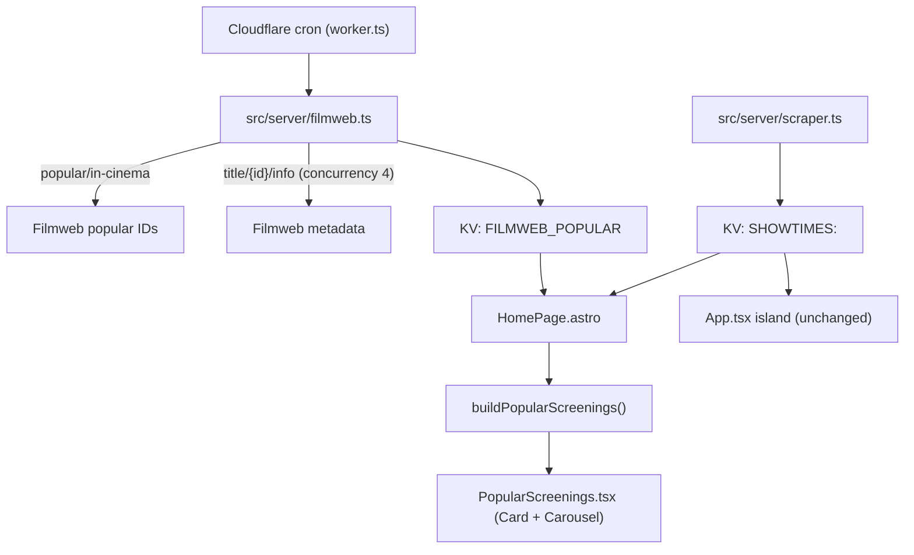

# Requirements

### Overview & Goals

Add a **Most Popular Screenings** section to the KinoRadar landing page (`/pl/`, `/en/`). It shows the films Filmweb currently ranks as most popular in cinemas, filtered down to those that actually have a screening today in a Warsaw cinema in our own scraped schedule, in Filmweb's popularity order.

### Scope

**In scope**
- New server-side Filmweb client (`popular/in-cinema` + `title/{id}/info`) with bounded concurrency and per-item failure tolerance.
- KV caching of the Filmweb popular list, refreshed by a new cron trigger (same pattern as the TMDB release catalog).
- Cross-referencing Filmweb films against today's cached Warsaw schedule (`Show[]` from `src/server/kv.ts`).
- New server-rendered section in `src/layouts/HomePage.astro`, placed above the existing `App` island, reusing the shadcn `Card` / `Carousel` visual language of `TodayShows.tsx`.
- Filmweb poster URL helper + no-poster fallback.
- PL/EN strings in `src/i18n/translations.ts`.

**Out of scope**
- Adding `filmwebId` to `Show` or to any of the ~20 cinema parsers.
- Date selection / filtering inside the new section (it always reflects *today* in Warsaw).
- Favorites toggling inside the new section.
- Any refactor of existing scrapers, filters, or the `App` island.

### User Stories

- As a visitor, I want to see at a glance which popular films are playing in Warsaw **today**, so I can pick a film without scrolling the full schedule.
- As a visitor, I want each popular film to show its poster, title, year, cinema and next screening time, so I can decide and jump straight to the film page.
- As a visitor, I want the landing page to load normally even when Filmweb is unreachable.

### Functional Requirements

1. Fetch `GET https://www.filmweb.pl/api/v1/film/popular/in-cinema` → ordered array of Filmweb IDs.
2. Fetch `GET https://www.filmweb.pl/api/v1/title/{id}/info` for those IDs **concurrently** with a concurrency limit (4), reusing `allSettledConcurrent`.
3. Individual detail failures are skipped and logged; they must not fail the section.
4. Filmweb popularity order is preserved end-to-end.
5. Each Filmweb film is matched against today's Warsaw shows; **films with no matching Warsaw screening are dropped**.
6. `subType: "film_cinema"` alone is never sufficient — a real screening match is required.
7. Only screenings from today's cached Warsaw schedule are considered; upcoming (not-yet-started) times are preferred when choosing what to display.
8. The section renders at most 12 films.
9. If the list resolves to zero films, or the Filmweb fetch fails entirely, the section is omitted silently — the rest of the landing page renders unchanged.
10. Filmweb results are cached in KV so requests are not repeated per page load.

### Non-Functional Requirements

- No Filmweb request is made from the browser; all calls run in the Cloudflare Worker.
- Landing page render must not regress: on a cache hit the section costs one extra KV read.
- Section is responsive and matches existing spacing/typography (`max-w-7xl`, card carousel).
- Section is only rendered for the landing page and cinema pages' parent layout path where the schedule is already loaded — not on film/favorites/releases pages.

# Technical Design

### Current Implementation

- **Schedule**: `src/server/scraper.ts#getShowsReport(date)` scrapes ~20 Warsaw cinemas concurrently (`allSettledConcurrent`, concurrency 3) and normalizes to `Show[]` via `src/lib/normalize.ts`.
- **Show model** (`src/lib/normalize.ts`): `{ title, canonicalTitle, times, screenings, cinema, link?, source?, poster? }`. **No Filmweb ID and no year.**
- **Caching**: `src/server/kv.ts` — schema-versioned KV entries `SHOWTIMES:<date>`, 24h TTL for complete data / 30m for partial.
- **Landing page**: `src/layouts/HomePage.astro` reads `getCachedSchedule(env.SHOWTIMES, today)` (falling back to a live scrape) and passes `schedule.shows` into the `App` React island → `TodayShows.tsx` (shadcn `Card` + `Carousel`).
- **External-API blueprint**: `src/server/releases.ts` (TMDB) — schema-versioned KV key, `get/set/refresh...IfStale` helpers, `fetchWithTimeout` from `src/server/fetch.ts`, cron wiring in `worker.ts` + `src/server/scheduled-jobs.ts`.
- **No Filmweb client, proxy, or poster helper exists today.**

### Key Decisions

1. **Server module + KV + cron** (confirmed): new `src/server/filmweb.ts` mirrors `src/server/releases.ts`. A new cron trigger refreshes the popular list; `HomePage.astro` only reads from KV and never blocks on a cold Filmweb fetch beyond a lazy fallback.
2. **Normalized-title matching** (confirmed): `Show` has no Filmweb ID and adding one would touch every parser, which is explicitly out of scope. Match Filmweb `title` **and** `originalTitle` against `show.canonicalTitle` using the same accent/case/whitespace normalization already used by `normalize.ts#normalizedTitleKey`.
3. **Astro server-rendered section** (confirmed): a static `PopularScreenings.tsx` rendered without hydration (no `client:*`) inside `HomePage.astro`, above `App`. Keeps zero extra JS and makes failure isolation trivial.
4. **Cache the Filmweb layer only, not the join.** KV stores the popularity-ordered Filmweb metadata; the join against Warsaw shows is computed per render from the already-loaded `schedule.shows`, so it always reflects the current schedule and current time.

### Proposed Changes

**`src/lib/filmweb.ts`** (shared, pure)
- `FilmwebFilm` type, `FILMWEB_POPULAR_SCHEMA_VERSION`, `isPopularFilmsCache()` validator, `isPopularFilmsCacheStale()` (mirrors `src/lib/releases.ts`).
- `filmwebPosterUrl(posterPath)` → `https://fwcdn.pl/fpo` + path with the `$` size placeholder replaced by a fixed size token; returns `null` for missing/invalid paths.
- `titleMatchKeys(film)` and `showTitleKey(show)` normalization helpers.

**`src/server/filmweb.ts`** (new)
- `fetchPopularFilmIds()` → validated `number[]`, preserving order.
- `fetchFilmInfo(id)` → `FilmwebFilm | null`.
- `fetchPopularFilms()` → `allSettledConcurrent(ids, 4, fetchFilmInfo)`, drops rejected/invalid entries, logs each failure as structured JSON, keeps order.
- `getCachedPopularFilms(kv)` / `setCachedPopularFilms(kv)` / `refreshPopularFilmsIfStale(kv)` / `getAvailablePopularFilms(kv)` — same shape as the `releases.ts` helpers, KV key `FILMWEB_POPULAR:<schemaVersion>`.
- All requests go through `fetchWithTimeout` (timeout + retry + structured retry logs) with `Accept: application/json`.

**`src/lib/popular-screenings.ts`** (new, pure — unit-testable)
- `buildPopularScreenings(films, shows, nowMinutes, limit)`:
  1. index `shows` by normalized title key (many shows per key, one per cinema/variant);
  2. walk `films` in order, look up by `title` then `originalTitle`;
  3. skip films with no match;
  4. for each match pick the display screening: earliest screening with `minutes >= nowMinutes`, else earliest of the day, reusing the same `toMinutes` regex logic already used in `App.tsx` (extracted/duplicated minimally into this module);
  5. stop at `limit`.

**`src/components/PopularScreenings.tsx`** (new)
- Props: `{ locale, items }`. Renders a `<section>` with heading + `Carousel` of `Card`s, poster (or `t.releases.noPoster` fallback block), title, year, cinema label, chosen screening time badge, and a link to `/{locale}/film/{filmSlug(canonicalTitle)}/?date={today}` — mirroring `TodayShows.tsx` markup so no new design tokens appear.

**`src/layouts/HomePage.astro`**
- Inside the existing `if (!favoritesPage && !film && !releaseCalendar)` block, after the schedule is resolved, wrap in `try/catch`: read `getCachedPopularFilms(env.SHOWTIMES)`, build items via `buildPopularScreenings(...)`, default to `[]` on any error.
- Render `{popularItems.length > 0 && <PopularScreenings locale={locale} items={popularItems} />}` above `<App ... />`.

**`worker.ts` + `src/server/scheduled-jobs.ts`**
- Add `FILMWEB_POPULAR_CRON` (e.g. `30 */4 * * *`) to `scheduledJobFor` as `{ kind: "filmweb" }`, a `refreshPopularFilms()` branch in `worker.ts#scheduled` guarded by try/catch with structured logging, and the cron expression to `wrangler.jsonc` `triggers.crons`.

**`src/i18n/translations.ts`**
- New `popular: { title, accent, eyebrow, nextScreening, noneAvailable }` block for `pl` and `en`, added to the `Translations` interface.

### Data Models / Contracts

```ts
// src/lib/filmweb.ts
export type FilmwebFilm = {
  id: number;
  title: string;
  originalTitle: string;
  year: number | null;
  subType: string;
  posterUrl: string | null;
};

export type PopularFilmsCache = {
  schemaVersion: number;
  updatedAt: string;
  films: FilmwebFilm[]; // popularity order
};

// src/lib/popular-screenings.ts
export type PopularScreeningItem = {
  filmwebId: number;
  title: string;        // canonical title from our schedule (used for the film link)
  displayTitle: string; // Filmweb localized title
  year: number | null;
  posterUrl: string | null;
  cinema: string;
  source?: string;
  screening: Screening;
  upcoming: boolean;
};

export function buildPopularScreenings(
  films: FilmwebFilm[],
  shows: Show[],
  nowMinutes: number,
  limit?: number,
): PopularScreeningItem[];
```

### Architecture Diagram



### File Structure

```
src/lib/filmweb.ts                     (new)  types, validators, poster URL, title keys
src/lib/popular-screenings.ts          (new)  pure Filmweb↔Show join
src/server/filmweb.ts                  (new)  fetching + KV cache + refresh helpers
src/components/PopularScreenings.tsx   (new)  server-rendered section
src/layouts/HomePage.astro             (mod)  load cache, join, render section
src/server/scheduled-jobs.ts           (mod)  new cron mapping
worker.ts                              (mod)  refreshPopularFilms branch
wrangler.jsonc                         (mod)  new cron trigger
src/i18n/translations.ts               (mod)  pl/en strings
tests/filmweb.test.mjs                 (new)
tests/popular-screenings.test.mjs      (new)
```

### Risks

- **Title matching is inherently lossy.** Polish distributor titles may differ from Filmweb's; matching both `title` and `originalTitle` mitigates this, and unmatched films are simply skipped (requirement 9). Some genuinely-playing popular films may be missed.
- **Filmweb poster URL convention is undocumented.** The `fwcdn.pl/fpo` + size-token substitution will be verified with a real request during implementation; if it fails, the section falls back to the no-poster block rather than rendering broken images.
- **Unofficial API / rate limits.** `fetchWithTimeout` bounds timeouts and retries, concurrency is capped at 4, and the cron interval keeps request volume low.
- **KV subrequest budget.** One extra KV read per landing page render, one extra cron job — well within Worker limits.
- **Duplicate screenings across cinemas**: only one screening per film is displayed (first matching cinema in schedule order), which is a deliberate simplification; the "all screenings" link leads to the existing film page.

# Testing

### Validation Approach

Follow the existing `node --experimental-strip-types --test tests/*.test.mjs` harness (see `tests/releases.test.mjs`, `tests/kv.test.mjs`, `tests/concurrency.test.mjs`) — pure functions and fetch/KV layers are tested with injected fakes, then the page is checked manually via `astro dev`.

### Key Scenarios

- `buildPopularScreenings` preserves Filmweb popularity order for matched films.
- A Filmweb film with no matching Warsaw show is skipped and the next one is used.
- Matching succeeds via `originalTitle` when the localized `title` differs.
- Matching is accent- and case-insensitive (e.g. `Zwiazek` vs `Związek`).
- Screening selection prefers the earliest **upcoming** time; when all of today's times have passed it falls back to the earliest and sets `upcoming: false`.
- `limit` caps the number of returned items.
- `filmwebPosterUrl` builds a URL from `"/93/88/10099388/8242946.$.jpg"` and returns `null` for empty/malformed paths.
- `fetchPopularFilms` with a stubbed fetcher returns all films in order at the configured concurrency.

### Edge Cases

- One `title/{id}/info` request rejects → that film is dropped, the rest still render.
- `popular/in-cinema` returns a non-array / malformed payload → throws, cache untouched, section omitted.
- KV cache miss and Filmweb unavailable → `HomePage.astro` catch yields `[]`, landing page renders `App` normally (verified by rendering the page with the binding stubbed to return `null`).
- Stale cache validator rejects entries with a mismatched `schemaVersion`.
- Empty `schedule.shows` (all cinemas failed) → no items, section omitted.

### Test Changes

- Add `tests/filmweb.test.mjs` — poster URL helper, response validation, cache validators, concurrent fetch with an injected fetcher.
- Add `tests/popular-screenings.test.mjs` — ordering, skipping, title/originalTitle matching, screening choice, limit.
- No changes to existing tests.

# Delivery Steps

### ✓ Step 1: Add Filmweb types, poster helper and title-matching primitives
`src/lib/filmweb.ts` exists with validated types, a working poster URL builder, and normalization helpers, covered by unit tests.

- Define `FilmwebFilm` and `PopularFilmsCache` types plus `FILMWEB_POPULAR_SCHEMA_VERSION`.
- Add `isPopularFilmsCache()` and `isPopularFilmsCacheStale()` validators modelled on `src/lib/releases.ts`.
- Implement `filmwebPosterUrl(posterPath)` building the `fwcdn.pl` URL by substituting the `$` size placeholder; return `null` for missing/malformed paths.
- Implement `titleMatchKeys(film)` / `showTitleKey(show)` reusing the accent+case+whitespace normalization already used by `normalize.ts#normalizedTitleKey`.
- Add `tests/filmweb.test.mjs` covering the poster helper and the cache validators.

### ✓ Step 2: Implement the server-side Filmweb client with concurrency and KV caching
`src/server/filmweb.ts` fetches the popularity-ordered film metadata and caches it in KV, tolerating individual failures.

- Implement `fetchPopularFilmIds()` against `https://www.filmweb.pl/api/v1/film/popular/in-cinema` using `fetchWithTimeout` from `src/server/fetch.ts`; validate the array shape and preserve order.
- Implement `fetchFilmInfo(id)` against `/api/v1/title/{id}/info`, mapping to `FilmwebFilm` (including `filmwebPosterUrl`).
- Implement `fetchPopularFilms()` using `allSettledConcurrent(ids, 4, fetchFilmInfo)`; drop rejected/invalid entries, log each failure as structured JSON, keep popularity order.
- Add `getCachedPopularFilms` / `setCachedPopularFilms` / `refreshPopularFilmsIfStale` / `getAvailablePopularFilms` over KV key `FILMWEB_POPULAR:<schemaVersion>`, mirroring `src/server/releases.ts`.
- Extend `tests/filmweb.test.mjs` with an injected fetcher: ordering preserved, single-detail failure tolerated, malformed popular payload throws.
- Verify the real poster URL convention with one live request and adjust the helper if needed.

### ✓ Step 3: Implement the Filmweb-to-Warsaw-screening join
`src/lib/popular-screenings.ts` turns Filmweb films plus today's `Show[]` into a ranked list of screenings that actually exist in Warsaw.

- Define `PopularScreeningItem` and `buildPopularScreenings(films, shows, nowMinutes, limit)`.
- Build a normalized-title index over `shows`, then walk `films` in popularity order matching on `title` then `originalTitle`.
- Skip films with no matching show so `film_cinema` alone never qualifies a film.
- Choose the display screening: earliest time `>= nowMinutes` (`upcoming: true`), else earliest of the day (`upcoming: false`), reusing the `toMinutes` parsing logic used in `App.tsx`.
- Apply the result limit (default 12) and carry `canonicalTitle`, `cinema`, `source`, `year`, `posterUrl` through for rendering.
- Add `tests/popular-screenings.test.mjs` covering ordering, skipping unmatched films, `originalTitle` matching, accent-insensitive matching, upcoming-vs-fallback selection, and the limit.

### ✓ Step 4: Render the Most Popular Screenings section on the landing page
The landing page shows a responsive "Most Popular Screenings" carousel above the existing schedule island, and degrades silently on failure.

- Add `src/components/PopularScreenings.tsx` reusing the shadcn `Card`/`Carousel` markup from `TodayShows.tsx`: poster or `noPoster` fallback block, title, year, cinema, screening-time badge, and a link to `/{locale}/film/{filmSlug(...)}/?date={today}`.
- Add a `popular` translation block (title, accent, eyebrow, next-screening label) for `pl` and `en` in `src/i18n/translations.ts` and extend the `Translations` interface.
- In `src/layouts/HomePage.astro`, inside the existing non-film/non-favorites/non-releases branch, read `getCachedPopularFilms(env.SHOWTIMES)` and call `buildPopularScreenings(...)` with `warsawTimeMinutes()`, wrapped in `try/catch` defaulting to `[]`.
- Render the section (without any `client:*` directive) above `<App ... />` only when items exist.
- Verify with `astro dev --background` that the section renders, is responsive, and that the page still renders normally when the KV cache is empty.

### ✓ Step 5: Wire the scheduled Filmweb refresh
The Filmweb popular list is refreshed on a cron so page loads never trigger the upstream fetch chain.

- Add `FILMWEB_POPULAR_CRON` and a `{ kind: "filmweb" }` job to `src/server/scheduled-jobs.ts#scheduledJobFor`.
- Add a `refreshPopularFilms()` branch in `worker.ts#scheduled`, guarded by try/catch with structured success/failure logging, dispatched via `ctx.waitUntil`.
- Add the new cron expression to `triggers.crons` in `wrangler.jsonc`.
- Extend the scheduled-jobs test to assert the new cron maps to the Filmweb job and unknown crons still return `null`.
- Run the full test suite (`pnpm test`) and a production-style check via `pnpm run preview` to confirm the cron registers and the section populates.