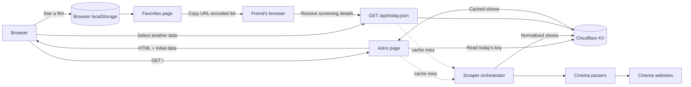
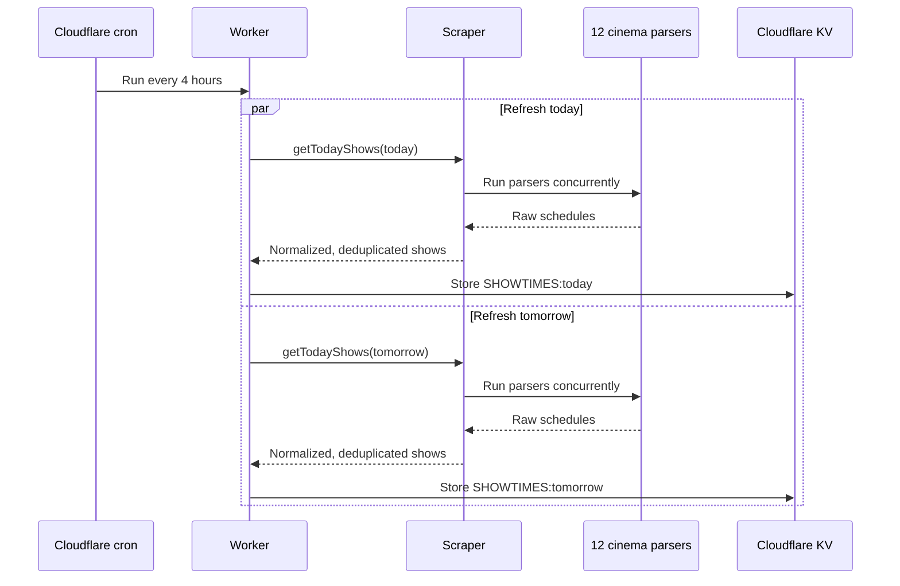

# KinoRadar

KinoRadar collects film schedules from independent cinemas in Warsaw and presents them in one place in Polish and English. Pick any of the next seven days, browse films grouped by cinema or film, filter for screenings with verified English audio or subtitles, and follow a ticket link to the cinema's website. Individual screening times can be starred and shared as a read-only favorites list. A separate calendar lists all announced Polish theatrical releases using localized TMDB metadata.

The application currently aggregates:

- Kinoteka
- Kino Muranów
- U-Jazdowski
- Kino Wisła
- Kino Atlantic
- Kinoluna
- Kino Kultura
- Kino Amondo
- Kino Elektronik
- Kino Cytadela
- Iluzjon
- Kinogram

Each cinema has its own parser because the source websites use different markup and schedule formats. KinoRadar runs all parsers independently, converts their results to a shared data model, and keeps results from the parsers that succeed even if another cinema is temporarily unavailable.

## How it works

On the first visit, Astro renders today's schedule on the server. The page hydrates a React application in the browser, where the date selector can request schedules for the following six days. Results are grouped by cinema and displayed in horizontal carousels. Each film links to a localized film page that combines its screenings across every cinema for the selected date.



The API accepts a `date=YYYY-MM-DD` query parameter. It checks KV first and, on a miss, scrapes all cinemas concurrently, normalizes and deduplicates the shows, stores the result for 24 hours, and returns JSON. Passing `force=1` bypasses the cache and refreshes the selected date.

Upcoming releases use TMDB's Discover API with the Polish region and limited/theatrical release types. Complete Polish and English catalogs are stored separately in KV, refreshed when older than 24 hours, and retained if a later refresh fails. The page renders eight complete release-date groups at a time so titles sharing a date are never split between batches.

A Cloudflare cron trigger runs every four hours and refreshes today and tomorrow in the background. This normally keeps the most frequently requested schedules warm without delaying a visitor's request.



## Architecture

KinoRadar uses Astro's server output with the Cloudflare adapter. Astro owns routing and server rendering, while React provides the interactive date selector and film carousels. Tailwind CSS supplies the styling, Cheerio parses cinema HTML, and Embla powers the carousels.

| Area | Responsibility | Main files |
| --- | --- | --- |
| Page and SSR | Renders localized home and cinema pages from today's cached data | `src/layouts/HomePage.astro`, `src/pages/` |
| Client UI | Selects a date, fetches new data, groups shows by cinema, and renders carousels | `src/components/` |
| Favorites | Stores up to 20 film, cinema, date, and time combinations in the browser and encodes read-only shared lists in the URL | `src/lib/favorites.ts`, `src/lib/useFavorites.ts`, `src/components/FavoritesPage.tsx` |
| Film pages | Resolves a normalized title slug and aggregates all cinema times for the selected date | `src/pages/[locale]/film/[slug].astro`, `src/components/FilmDetails.tsx` |
| JSON API | Validates the requested date and implements cache-first retrieval | `src/pages/api/today.json.ts` |
| Scraping | Runs cinema parsers concurrently, tolerates individual failures, normalizes results, and removes duplicates | `src/server/scraper.ts` |
| Cinema adapters | Fetch and extract schedules from each cinema's website | `src/lib/parsers/` |
| Data model | Converts cinema-specific output into the common `Show` shape | `src/lib/normalize.ts` |
| Cache | Reads and writes date-based entries with a 24-hour TTL | `src/server/kv.ts` |
| Worker and cron | Serves Astro and preloads today and tomorrow on a schedule | `worker.ts` |
| Upcoming releases | Fetches Polish theatrical dates from TMDB, caches localized catalogs, and serves date-grouped pages | `src/server/releases.ts`, `src/pages/api/releases.json.ts`, `src/components/UpcomingReleases.tsx` |
| Infrastructure | Configures Astro, Cloudflare Workers, static assets, cron, and the KV binding | `astro.config.mjs`, `wrangler.jsonc` |

The normalized shape shared by the server, API, and UI is:

```ts
type Show = {
  // Existing source fields retained for API compatibility.
  title: string;
  times: string[];
  cinema: string;
  link?: string;
  source?: string;
  poster?: string;

  // Additive canonical identity and per-screening metadata.
  canonicalTitle: string;
  screenings: Array<{
    time: string;
    link?: string;
    audioLanguage?: string;
    subtitleLanguages?: string[];
    subtitled?: boolean;
    dubbed?: boolean;
  }>;
};
```

Language codes are normalized to lowercase ISO 639-1 values. Missing language fields mean that the source did not provide verified information; KinoRadar does not guess. Generic `napisy` and `dubbing` labels are retained as generic badges. A screening is included by the English-friendly filter only when English audio or English subtitles are explicit.

Cache entries use the key format `SHOWTIMES:YYYY-MM-DD` and carry a schema version. Records from older schemas are treated as misses and refreshed. Display grouping uses `canonicalTitle`, while the source-provided `title`, `times`, and `link` remain available to API consumers.

## Project structure

```text
.
├── public/                    # Favicons and static assets
├── src/
│   ├── components/            # Hydrated React UI
│   ├── data/cinemas.ts        # Shared cinema names and stable slugs
│   ├── i18n/                  # Polish and English translations
│   ├── lib/
│   │   ├── parsers/           # One adapter per cinema
│   │   └── normalize.ts       # Shared schedule model
│   ├── pages/
│   │   ├── api/today.json.ts  # Date-based schedule endpoint
│   │   ├── [locale]/kino/     # Localized cinema landing pages
│   │   ├── [locale]/film/     # Localized aggregate film pages
│   │   ├── en/ and pl/        # Localized home and favorites pages
│   │   └── index.astro        # Permanent redirect to Polish
│   ├── server/
│   │   ├── kv.ts              # KV cache access
│   │   └── scraper.ts         # Parser orchestration
│   └── styles/global.css
├── worker.ts                  # Cloudflare fetch and cron handlers
├── astro.config.mjs
├── wrangler.jsonc
└── package.json
```

## Local development

Requirements:

- Node.js 22.12 or newer
- npm

Install dependencies and start Astro's development server:

```sh
npm install
npm run dev
```

The site is available at `http://localhost:4321` by default. Because server-rendered routes use the `SHOWTIMES` Cloudflare binding, use the Wrangler-backed preview when you need to test the production runtime and KV integration:

```sh
npm run preview
```

The upcoming-release calendar additionally requires a TMDB API Read Access Token. Copy the example file and replace its placeholder for local Wrangler development:

```sh
cp .dev.vars.example .dev.vars
```

Useful commands:

| Command | Purpose |
| --- | --- |
| `npm run dev` | Start the Astro development server |
| `npm run build` | Create the production build in `dist/` |
| `npm run preview` | Build and run the app locally with Wrangler |
| `npm run generate-types` | Regenerate Cloudflare binding types |
| `npm run deploy` | Build and deploy the Cloudflare Worker |
| `npm run astro -- --help` | Show Astro CLI help |

## API

```http
GET /api/today.json?date=2026-08-09
```

The response is a JSON array of normalized `Show` objects. If `date` is absent or invalid, the server uses the current Warsaw calendar date. Pass `meta=1` to receive the schedule object with `schemaVersion`, `updatedAt`, and `failedCinemas` in addition to `shows`.

To skip a cached value:

```http
GET /api/today.json?date=2026-08-09&force=1
```

This endpoint is public. `force=1` should therefore be used carefully because every request fetches all cinema websites.

Upcoming releases are available through:

```http
GET /api/releases.json?locale=pl&q=diuna&genre=878&cursor=2026-09-04
```

`locale` is required and accepts `pl` or `en`. `q` and `genre` filter the complete cached catalog before results are grouped. `cursor` is the last rendered release date and returns the next eight complete date groups. The response includes the groups, localized genre options, matching counts, the next cursor, update time, and a stale-data flag.

## Adding a cinema

1. Add a parser in `src/lib/parsers/`. It should export an async parse function and a `siteName`, and return objects containing at least a title and screening times. Links and posters are optional.
2. Add its display name and stable source slug to `src/data/cinemas.ts`.
3. Register the parser in `CINEMA_PARSERS` in `src/server/scraper.ts` using that registry entry.
4. Build the project and exercise the API for a date that has a published schedule.

Parsers should throw on unsuccessful upstream responses. Shared upstream requests time out after eight seconds. The orchestrator uses `Promise.allSettled`, logs failures, and still returns results from the other cinemas.

## Search engine deployment checklist

After deploying changes to routes or metadata:

1. Confirm `/` permanently redirects to `/pl/`.
2. Confirm `/robots.txt`, `/sitemap-index.xml`, both localized homepages, and representative cinema pages return successfully.
3. Validate canonical and reciprocal `hreflang` links in the rendered HTML.
4. Validate the JSON-LD with Google's Rich Results Test.
5. Verify `kinoradar.pl` in Google Search Console using a DNS record.
6. Submit `https://kinoradar.pl/sitemap-index.xml` and inspect `/pl/`, `/en/`, and representative cinema URLs.
7. Monitor indexing, queries, click-through rate, and Core Web Vitals after releases.

The sitemap contains the two localized homepages and 12 cinema pages per language. Cinema pages intentionally omit `LocalBusiness` markup until verified addresses and venue details are available.

Favorites live only in the visitor's browser; no account or backend write is required. Shared URLs contain the canonical film identity, selected screening, and compact language metadata, are limited to 20 items, render read-only, use clean canonical URLs, and are excluded from indexing and the sitemap. Favorites and shared lists use payload version 3; earlier local or shared versions are intentionally not migrated.

## Deployment

The production target is Cloudflare Workers. Before deploying your own instance, update the Worker name and KV namespace ID in `wrangler.jsonc`, ensure the `SHOWTIMES` binding exists, and add the TMDB token as a Worker secret:

```sh
npx wrangler secret put TMDB_API_TOKEN
```

Then deploy with:

```sh
npm run deploy
```

The same configuration defines the `0 */4 * * *` cron schedule and enables Worker observability.
